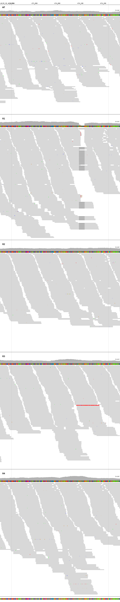
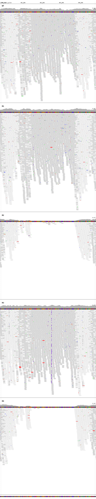

# Amphotericin b mode of action
## This repository contains the scripts used for the data analysis

    Wellcome Centre for Anti-Infectives Research
    School of Life Sciences, University of Dundee

- The Jupyter notebooks count_oligo.ipynb was used to count the subsequences in the Whole Genome Sequence (WGS) samples
- The folder OVarFlow contains the script for the variant calling pipeline

## 

## Small deletion of LdBPK.28.2.001350 in sample R1
  

## Small deletion of SMT1 in Sample R3 and KO of SMT1 in R2 and R4 Samples
  

