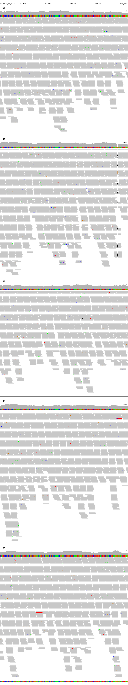

# Amphotericin b mode of action
## This repository contains the scripts used for the data analysis

    Wellcome Centre for Anti-Infectives Research
    School of Life Sciences, University of Dundee

## Small deletion in LdBPK.28.2.001350 of sample R1
  

## Small deletion of SMT1 in Sample R3 and KO of SMT1 in Sample R2 and R4
  

The Jupyter notebooks
- count_oligo.ipynb was used to count the subsequences in the Whole GEnome Sequence (WGS) samples

